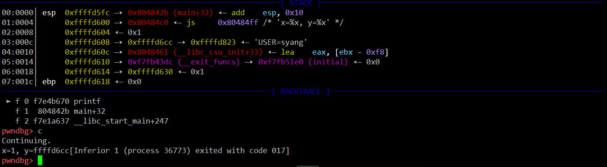

## Exercise 3

> At what point does the processor start executing 32-bit code? What exactly causes the switch from 16-bit to 32-bit mode?

The instruction which starts executing 32-bit code is a `0x7c2d: ljmp $0x8,$0x7c32`.

```shell
(gdb)
[   0:7c2d] => 0x7c2d:  ljmp   $0x8,$0x7c32
0x00007c2d in ?? ()
(gdb)
The target architecture is assumed to be i386
=> 0x7c32:      mov    $0x10,%ax
```

And we can confirm it easily according to `boot.S` and `boot.asm`.

```asm
  # Jump to next instruction, but in 32-bit code segment.
  # Switches processor into 32-bit mode.
  ljmp    $PROT_MODE_CSEG, $protcseg
```

After learning from the [wiki](https://wiki.osdev.org/Protected_Mode), we can understand the following code loads GDT and sets the lowest bit of CR0:

```asm
  # Switch from real to protected mode, using a bootstrap GDT
  # and segment translation that makes virtual addresses 
  # identical to their physical addresses, so that the 
  # effective memory map does not change during the switch.
  lgdt    gdtdesc
  movl    %cr0, %eax
  orl     $CR0_PE_ON, %eax
  movl    %eax, %cr0
```

Then, after executing `ljmp   $0x8,$0x7c32`, the program switch to 32-bit mode.

> What is the last instruction of the boot loader executed, and what is the first instruction of the kernel it just loaded?

From `boot.S`, `main.c` and `boot.asm`, we can find the last instruction executed is `7d5e:	ff 15 18 00 01 00    	call   *0x10018`.

Using gdb, it's easy to find which instruction in memory 0x10018:

```shell
(gdb) x/i *0x10018
   0x10000c:    movw   $0x1234,0x472
```

And it's also very easy to confirm it by using objdump:

```shell
objdump -x ~/jos/lab/obj/kern/kernel

kernel:     file format elf32-i386
kernel
architecture: i386, flags 0x00000112:
EXEC_P, HAS_SYMS, D_PAGED
start address 0x0010000c
...
```

So the first instruction of kernel is: `0x10000c:    movw   $0x1234,0x472`

> Where is the first instruction of the kernel?

It's easily find answer from question2, the first instruction of kernel's location in memory is `0x10000c`. 

> How does the boot loader decide how many sectors it must read in order to fetch the entire kernel from disk? Where does it find this information?

According to the function `bootmain` in `main.c`:

```C
	// load each program segment (ignores ph flags)
	ph = (struct Proghdr *) ((uint8_t *) ELFHDR + ELFHDR->e_phoff);
	eph = ph + ELFHDR->e_phnum;
	for (; ph < eph; ph++)
		// p_pa is the load address of this segment (as well
		// as the physical address)
		readseg(ph->p_pa, ph->p_memsz, ph->p_offset);
```

Since `ELFHDR->e_phoff` is the offset of segment and `ELFHDR->e_phnum` is the number of segment, that code using a loop to load all segments of the kernel into the memory.

This picture may help us understand what that code does(Learning Linux C/C++ Programming from Scratch, San Soong):


## Exercise 8

> Explain the interface between printf.c and console.c. Specifically, what function does console.c export? How is this function used by printf.c?

`console.c` exports `cputchar` \\ `getchar` \\ `iscons` three functions, and `cputchar` is used by `putch` in `printf.c`. As we invoke `cprintf`, `cprintf` will invoke `vcprintf`, `vcprintf` will invoke `vprintfmt`, and `putch` is one of the args of `vprintfmt`. So these two files associated in such way.

> Explain the following from console.c:

```C
    if (crt_pos >= CRT_SIZE) {
        int i;
        memmove(crt_buf, crt_buf + CRT_COLS, (CRT_SIZE - CRT_COLS) * sizeof(uint16_t));
        for (i = CRT_SIZE - CRT_COLS; i < CRT_SIZE; i++)                  crt_buf[i] = 0x0700 | ' ';
        crt_pos -= CRT_COLS;
    }
```

It's executed when the chars are too many so that screen is full, and it will scroll down one row to show more chars.

> For the following questions you might wish to consult the notes for Lecture 2. These notes cover GCC's calling convention on the x86.
> Trace the execution of the following code step-by-step:

```C
int x = 1, y = 3, z = 4;
cprintf("x %d, y %x, z %d\n", x, y, z);
```

- > In the call to cprintf(), to what does fmt point? To what does ap point?

`fmt` pointes to the string such as `"x %d, y %x, z %d\n"`, and ap pointes to variable arguments such as ` x, y, z`

- > List (in order of execution) each call to cons_putc, va_arg, and vcprintf. For cons_putc, list its argument as well. For va_arg, list what ap points to before and after the call. For vcprintf list the values of its two arguments.  

It's easy to get those information by using gdb.

The argument of `cons_putc` is each character's ascii value. 

For example: `x 1, y 3, z 4 [120, 32, 49, 44, 32, 121, 32, 51, 44, 32, 122, 32, 52]` is here:

```shell
#0  cputchar (c=120) at kern/console.c:458
#0  cputchar (c=32) at kern/console.c:458
#0  cputchar (c=49) at kern/console.c:458
...
```

After executing `va_arg`, we can find the value of `ap`'s change: `0xf010ff54` => `0xf010ff58` => `0xf010ff5c`.

And from gdb, we know that the value in the memory is `1 3 4`, which is the value of `x, y, z`.

```shell
pwndbg> x/4x 0xf010ff54
0xf010ff54:     0x00000001      0x00000003      0x00000004      0x00000001
```

And `vcprintf`'s arguments's value is below:

```shell
#1  0xf01008f9 in vcprintf (fmt=0xf0101877 "\n6828 decimal i"..., ap=0xf010ffe4 "\254\032") at kern/printf.c:21
```

> Run the following code.

```C
unsigned int i = 0x00646c72;
cprintf("H%x Wo%s", 57616, &i);
```
- > What is the output? Explain how this output is arrived at in the step-by-step manner of the previous exercise. Here's an ASCII table that maps bytes to characters.

The output is `He110 World`. The `%x` means that `57616` is printed in hex format `0xe110`, so `H%x` is `He110`. And `%s` means printed as string, so `i` will be explained as a string. Since x86 is little-endian, so the string is `orld\0` (`72 6c 64 00`).

- > The output depends on that fact that the x86 is little-endian. If the x86 were instead big-endian what would you set i to in order to yield the same output? Would you need to change 57616 to a different value?

In order to get the same output in `big-endian`, `i` will be set as `1919706112`, which is also `72 6c 64 00` in memory. And it's not necessary to change 57616 to a different value.

> In the following code, what is going to be printed after 'y='? (note: the answer is not a specific value.) Why does this happen?

```C    
cprintf("x=%d y=%d", 3);
```

Since `y` is uncertain, we don't know which will printed after we executed this program.

But we are sure that the value is a 4 bytes next to `3` in a higher address on the stack, here is a example by using gdb:



> Let's say that GCC changed its calling convention so that it pushed arguments on the stack in declaration order, so that the last argument is pushed last. How would you have to change cprintf or its interface so that it would still be possible to pass it a variable number of arguments?

The code below is `stdarg.h`, so we can find it's hard to modify the function like `__builtin_va_arg` since it's built function in compiler. 

```C
/*	$NetBSD: stdarg.h,v 1.12 1995/12/25 23:15:31 mycroft Exp $	*/

#ifndef JOS_INC_STDARG_H
#define	JOS_INC_STDARG_H

typedef __builtin_va_list va_list;

#define va_start(ap, last) __builtin_va_start(ap, last)

#define va_arg(ap, type) __builtin_va_arg(ap, type)

#define va_end(ap) __builtin_va_end(ap)

#endif	/* !JOS_INC_STDARG_H */
```

We can find out how those builtin functions achieve and then make the change. Another way is that we count how many `%` in fmt string and each time when we want to get the actual value, we can compute it since we know the last one pushed into the stack is the last arg and the the number of args is known. 