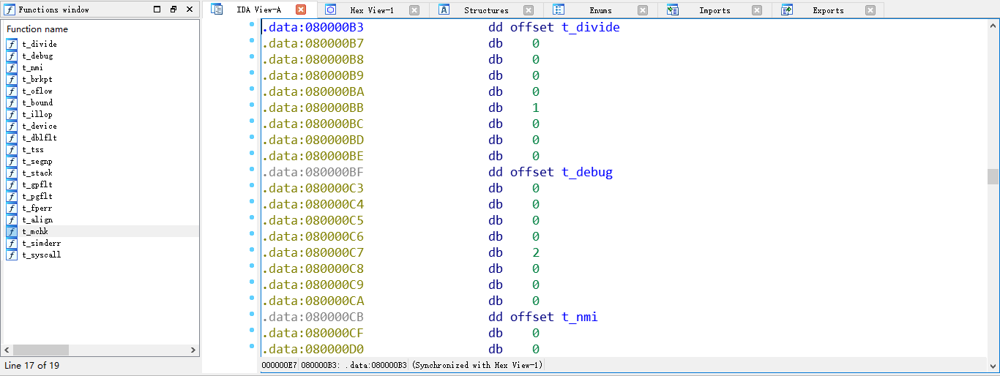

## Question1

> What is the purpose of having an individual handler function for each exception/interrupt? (i.e., if all exceptions/interrupts were delivered to the same handler, what feature that exists in the current implementation could not be provided?)

Since different exception/interrupt has different causes and ways to handle. If we want to deliver all of them to a same handle, them can't be handled correctly. Or we can handle them well by adding `if/else` or `switch`, while it's a bad design. So the better design is that each one has an individual handler.

## Question2

> Did you have to do anything to make the `user/softint` program behave correctly? The grade script expects it to produce a general protection fault (trap 13), but `softint`'s code says `int $14`. Why should this produce interrupt vector 13? What happens if the kernel actually allows softint's `int $14` instruction to invoke the kernel's page fault handler (which is interrupt vector 14)?

Since our program is in a user mode but the interrupt vector 14 can only be invoked by kernel mode. So if we want to trigger off `int $14`, we will get `int $13`(general protection fault). If kernel allows softint's `int $14`, it will cause a security problem since every program can malloc the page as its wish.

## Question3

> The break point test case will either generate a break point exception or a general protection fault depending on how you initialized the break point entry in the IDT (i.e., your call to `SETGATE` from `trap_init`). Why? How do you need to set it up in order to get the breakpoint exception to work as specified above and what incorrect setup would cause it to trigger a general protection fault?

If we set break point exception like this: `SETGATE(idt[T_BRKPT], 0, GD_KT, t_brkpt, 3);`, then as the permission set, we can find that user can debug in user space since then privilege level of breakpoint exception in IDT is **3**. If we set the privilege level to **0** as other break point exception, it will trigger a general protection fault because that user doesn't have the permission to execute `int $3` instruction.

## Question4

> What do you think is the point of these mechanisms, particularly in light of what the user/softint test program does?

This mechanisms can protect kernel or other proecess well when a exception happens. The user program can only trap into kernel and do something limited after the privilege check. For example, the question2 raise a question why our program execute `int $14` but get a general protection fault(`int $13`), just because that `int $14` is kernel privilege level, the kernel will generate a general protection fault.

## Description 

This lab is about user environment. We need implement some functions in kernel in order to make our user environment run well, and we also have to make our jos kernel handle interrupt and exception.

### User Environment

The first step is make jos support `env`, which like what we do in lab2.

We should implement the function initialize `Env` structures. When we need a new user environment, we need to call `env_create`, and this function will call `env_alloc` to allocate a new environment first. When we execute `env_alloc` function, we will `env_setup_vm` to allocate a page directory for this new environment.

After allocate the new environment, we will call `load_icode` to parse and load an ELF binary image. In this function, we will execute `region_alloc` to allocates and maps physical memory for the environment.

And now we can run our user environment easyily by `env_run`.

### Handling Interrupts and Exceptions

The next step is about handling interrupts and exceptions.

#### Setup the `idt` table

In this step, we need to modify `trap_init()` to initialize the `idt` to point to each of these entry points defined in `trapentry.S`

And I implements challenge here to simplify my code:

```asm
#define TRAPHANDLER_SUPER(name, num, ec, perm)						\
.text;                                          \
	.globl name;		/* define global symbol for 'name' */	\
	.type name, @function;	/* symbol type is function */		\
	.align 2;		/* align function definition */		\
	name:			/* function starts here */		\
    .if ec == 0;                              \
        pushl $0;                           \
    .endif;                                \
	pushl $(num);							\
	jmp _alltraps;                          \
.data;                                       \
    .long num, name, perm
.data 
    .globl trapEntry
    trapEntry:

.text

/*
 * Lab 3: Your code here for generating entry points for the different traps.
 */
	TRAPHANDLER_SUPER(t_divide, T_DIVIDE, 0, 0);
	TRAPHANDLER_SUPER(t_debug, T_DEBUG, 0, 0);
	TRAPHANDLER_SUPER(t_nmi, T_NMI, 0, 0);
	TRAPHANDLER_SUPER(t_brkpt, T_BRKPT, 0, 3);
	TRAPHANDLER_SUPER(t_oflow, T_OFLOW, 0 ,0);
	TRAPHANDLER_SUPER(t_bound, T_BOUND, 0 ,0);
	TRAPHANDLER_SUPER(t_illop, T_ILLOP, 0 ,0);
	TRAPHANDLER_SUPER(t_device, T_DEVICE, 0 ,0);
	TRAPHANDLER_SUPER(t_dblflt, T_DBLFLT, 1, 0);
	TRAPHANDLER_SUPER(t_tss, T_TSS, 1, 0);
	TRAPHANDLER_SUPER(t_segnp, T_SEGNP, 1, 0);
	TRAPHANDLER_SUPER(t_stack, T_STACK, 1, 0);
	TRAPHANDLER_SUPER(t_gpflt, T_GPFLT, 1, 0);
	TRAPHANDLER_SUPER(t_pgflt, T_PGFLT, 1, 0);
	TRAPHANDLER_SUPER(t_fperr, T_FPERR, 0, 0);
	TRAPHANDLER_SUPER(t_align, T_ALIGN, 1, 0);
	TRAPHANDLER_SUPER(t_mchk, T_MCHK, 0, 0);
	TRAPHANDLER_SUPER(t_simderr, T_SIMDERR, 0, 0);
	TRAPHANDLER_SUPER(t_syscall, T_SYSCALL, 0 ,3);
.data
	.long 0, 0, 0
```

```C
void
trap_init(void)
{
	extern struct Segdesc gdt[];
	extern long trapEntry[][3];
	
	for (int i = 0; trapEntry[i][1] != 0; i++ )
		SETGATE(idt[trapEntry[i][0]], trapEntry[i][2], GD_KT, trapEntry[i][1], trapEntry[i][2]);
	// Per-CPU setup 
	trap_init_percpu();
}
```

First, I define a array `trapEntry` in `trapEntry.S`, and push the function address, whether need error code, and the permission bits. So in `trap.c`, I can invoke them by a loop easily.

But to be honest, this excellent code is not writen by me, I first see it in someone's blog: [https://buweilv.github.io/2017/06/16/user-evn-1/](https://buweilv.github.io/2017/06/16/user-evn-1/)

It use simply code define the function in .text segment and the entry array in .data segment, here is a ida view:



#### Dispatch

It is easy to implement `trap_dispatch` function by using `if`/`else` or `switch`/`case` 

It seems to achieve the challenge beacuse it is about change the bit:

```C
int mon_step(int argc, char **argv, struct Trapframe *tf)
{
	if (tf == NULL || !(tf->tf_trapno == T_BRKPT || tf->tf_trapno == T_DEBUG)) {
        return 0;
	}
    tf->tf_eflags |= FL_TF;
	cprintf("eip at\t%08x\n", tf->tf_eip);
    return 0;
}

int mon_continue(int argc, char **argv, struct Trapframe *tf)
{
	if (tf == NULL || !(tf->tf_trapno == T_BRKPT || tf->tf_trapno == T_DEBUG)) {
        return 0;   
	}
    tf->tf_eflags &= ~FL_TF;
	return 0;
}
```

And the only problem is that, I don't know the entry point of this function, maybe we need to use it in a debug mode such as pause?

#### User-Mode Startup

We only need to change `thisenv = &envs[ENVX(sys_getenvid())];` in `libmain()`.

#### Page Faults and Memory Protection

We should check the low bits of the `tf_cs` in `page_fault_handler()`:

```C
void
page_fault_handler(struct Trapframe *tf)
{
	...
	if ((tf->tf_cs&3) == 0) {
    	panic("page fault");
  	}
    ...
}
```

And then implement `user_mem_check` and use it to check arguments to system calls in function `sys_cputs()`:

```C
static void
sys_cputs(const char *s, size_t len)
{
	// Check that the user has permission to read memory [s, s+len).
	// Destroy the environment if not.
	user_mem_assert(curenv, s, len, PTE_U);
	// Print the string supplied by the user.
	cprintf("%.*s", len, s);
}
```